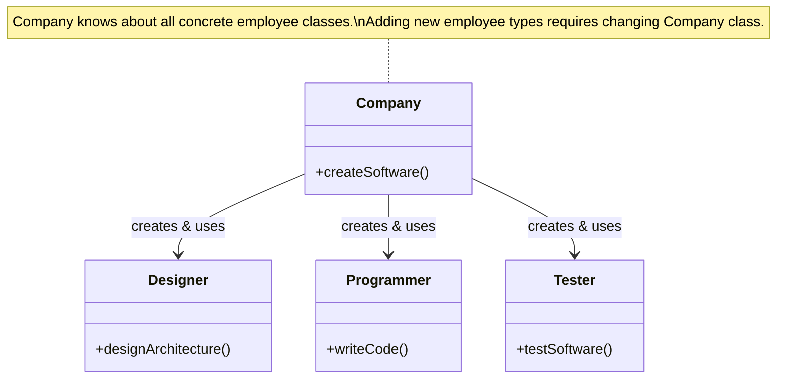
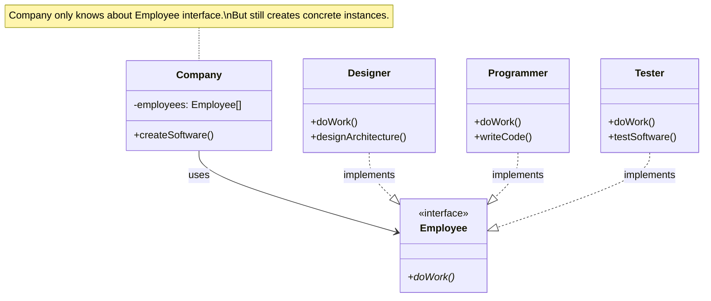
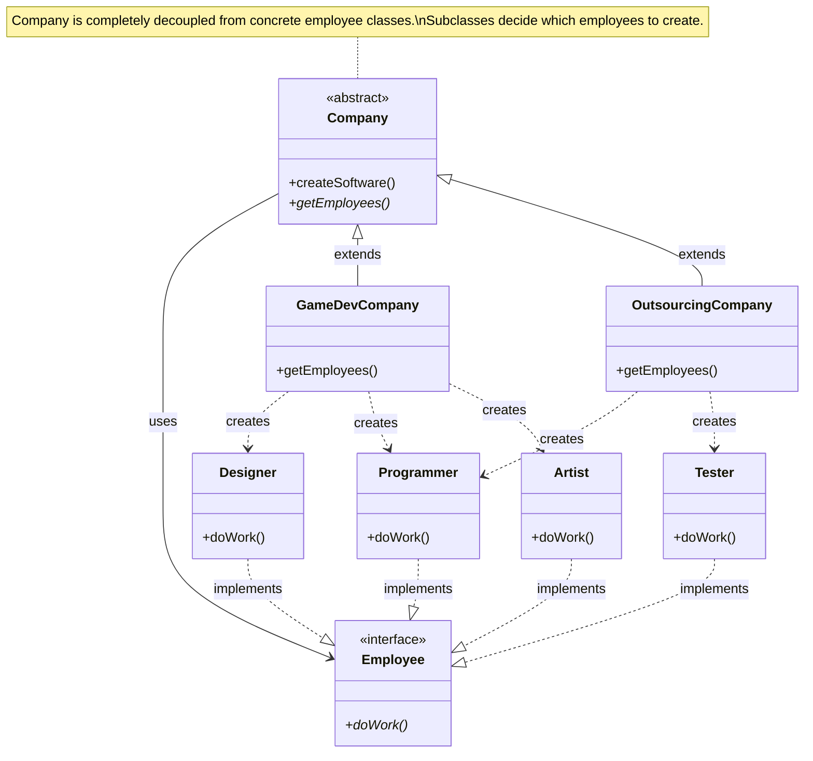

# Program to an Interface, Not an Implementation

## Overview
This principle is fundamental to writing flexible, maintainable code. It means your code should depend on abstractions (interfaces) rather than concrete implementations. This allows you to change implementations without breaking existing code.

## The Problem: Tightly Coupled Code

When classes directly depend on concrete implementations, any change to those implementations can break the dependent code. This creates a rigid, hard-to-maintain system.

## The Solution: Programming to Interfaces

By introducing interfaces (abstract base classes in Python), we create a contract that concrete classes must follow. Other classes then depend on this interface, not the concrete implementations.

## Three Iterations of the Company-Employee Example

### Iteration 1: Tightly Coupled (❌ BAD)



**Problems:**
- Company class directly creates and knows about Designer, Programmer, and Tester
- Adding new employee types requires modifying Company class
- Can't easily test Company in isolation (tightly coupled to concrete classes)
- Violates Open/Closed Principle

**Python Code:**
```python
class Company:
    def createSoftware(self):
        # Company is tightly coupled to concrete classes
        designer = Designer()
        designer.designArchitecture()
        
        programmer = Programmer()
        programmer.writeCode()
        
        tester = Tester()
        tester.testSoftware()
```

### Iteration 2: Using Interface/Polymorphism (✅ BETTER)



**Improvements:**
- Company now works with Employee interface
- Polymorphism allows different behaviors through same interface
- Easier to add new employee types (just implement Employee interface)

**Remaining Problems:**
- Company still creates concrete employee instances
- Different company types would need to override employee creation logic

**Python Code:**
```python
from abc import ABC, abstractmethod

# The Interface
class Employee(ABC):
    @abstractmethod
    def doWork(self):
        pass

# Concrete Implementations
class Designer(Employee):
    def doWork(self):
        self.designArchitecture()
    
    def designArchitecture(self):
        print("Creating UML diagrams...")

class Programmer(Employee):
    def doWork(self):
        self.writeCode()
    
    def writeCode(self):
        print("Writing Python code...")

class Company:
    def __init__(self):
        # Still creating concrete classes, but treating as Employee type
        self.employees = [
            Designer(),
            Programmer(),
            Tester()
        ]
    
    def createSoftware(self):
        # Company only knows about Employee interface
        for employee in self.employees:
            employee.doWork()  # Polymorphism in action
```

### Iteration 3: Factory Method Pattern (✅✅ BEST)



**Benefits:**
- Company class is completely independent of concrete employee classes
- Easy to add new company types with different employee mixes
- Each company subclass decides which employees it needs
- Follows Open/Closed Principle - can extend without modifying existing code
- Follows Dependency Inversion Principle - high-level modules don't depend on low-level modules

**Python Code:**
```python
from abc import ABC, abstractmethod

class Employee(ABC):
    @abstractmethod
    def doWork(self):
        pass

class Company(ABC):
    def createSoftware(self):
        # Company uses Employee interface, doesn't create concrete classes
        employees = self.getEmployees()
        for employee in employees:
            employee.doWork()
    
    @abstractmethod
    def getEmployees(self):
        """Factory Method - subclasses decide which employees to create"""
        pass

# Concrete Company Types
class GameDevCompany(Company):
    def getEmployees(self):
        return [
            Designer(),
            Artist(),  # Game companies need artists!
            Programmer()
        ]

class OutsourcingCompany(Company):
    def getEmployees(self):
        return [
            Programmer(),
            Tester()  # Focus on implementation and testing
        ]

# Concrete Employee Types
class Designer(Employee):
    def doWork(self):
        print("Creating game design documents...")

class Artist(Employee):
    def doWork(self):
        print("Drawing character sprites...")

class Programmer(Employee):
    def doWork(self):
        print("Coding game mechanics...")

class Tester(Employee):
    def doWork(self):
        print("Finding bugs...")

# Usage
game_company = GameDevCompany()
game_company.createSoftware()  # Works with its specific employee mix

outsourcing = OutsourcingCompany()
outsourcing.createSoftware()  # Works with different employee mix
```

## Key Concepts Explained

### Who Uses the Interface?

**The Company class uses the Employee interface** - this is the crucial point. The Company class:
- Declares variables of type `Employee` (the interface)
- Calls methods defined in the `Employee` interface
- Never directly references concrete classes like `Designer` or `Programmer`

### How Does This Work?

1. **Interface as Contract**: The `Employee` interface defines what methods all employees must have (`doWork()`)

2. **Concrete Classes Implement**: Each employee type (Designer, Programmer, etc.) implements the interface in their own way

3. **Client Uses Interface**: Company only knows about and uses the Employee interface

4. **Runtime Polymorphism**: At runtime, the actual concrete object's method is called

### Real-World Example: Data Processing

```python
# Without Interface (Tightly Coupled)
class DataProcessor:
    def process_data(self, source_type, data):
        if source_type == "csv":
            reader = CSVReader()
            return reader.read_csv(data)
        elif source_type == "json":
            reader = JSONReader()
            return reader.read_json(data)
        # Must modify this method for each new format!

# With Interface (Loosely Coupled)
class DataReader(ABC):
    @abstractmethod
    def read(self, data):
        pass

class CSVReader(DataReader):
    def read(self, data):
        return pandas.read_csv(data)

class JSONReader(DataReader):
    def read(self, data):
        return json.loads(data)

class DataProcessor:
    def process_data(self, reader: DataReader, data):
        # Only knows about DataReader interface
        return reader.read(data)

# Usage - can add new formats without changing DataProcessor
processor = DataProcessor()
processor.process_data(CSVReader(), "data.csv")
processor.process_data(JSONReader(), "data.json")
processor.process_data(XMLReader(), "data.xml")  # New format, no changes needed!
```

## Benefits of Programming to Interfaces

1. **Flexibility**: Can swap implementations without changing client code
2. **Testability**: Easy to create mock implementations for testing
3. **Maintainability**: Changes to concrete classes don't affect clients
4. **Extensibility**: Can add new implementations without modifying existing code
5. **Decoupling**: Reduces dependencies between classes

## When to Use This Pattern

- When you have multiple classes with similar behaviors
- When you want to be able to swap implementations
- When you need to support different variations of an algorithm
- When you want to isolate your code from third-party libraries
- When writing code that others will extend

## Common Pitfalls to Avoid

1. **Over-abstraction**: Don't create interfaces for single implementations
2. **Leaky Abstractions**: Interface shouldn't expose implementation details
3. **Interface Segregation**: Keep interfaces focused and small
4. **Forced Abstraction**: Not everything needs an interface

## Relationship to SOLID Principles

- **Open/Closed Principle**: Open for extension (new implementations), closed for modification
- **Dependency Inversion**: Depend on abstractions, not concretions
- **Liskov Substitution**: Any implementation should be substitutable for the interface

## Summary

Programming to interfaces is about creating flexible boundaries in your code. The interface acts as a contract that defines *what* needs to be done, while concrete classes define *how* it's done. This separation allows you to change the "how" without affecting code that depends on the "what".