# Mermaid Diagram Layout & Organization Guide

## Table of Contents
1. [Basic Direction Control](#basic-direction-control)
2. [Node Positioning Strategies](#node-positioning-strategies)
3. [Subgraphs for Layering](#subgraphs-for-layering)
4. [Advanced Layout Techniques](#advanced-layout-techniques)
5. [Common Layout Patterns](#common-layout-patterns)
6. [Tips & Best Practices](#tips--best-practices)

## Basic Direction Control

Mermaid provides four primary flow directions that control how your diagram grows:

### Flow Directions

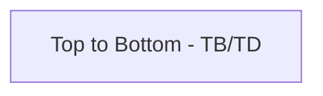

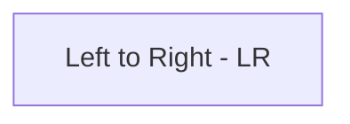

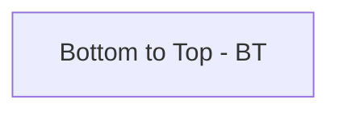

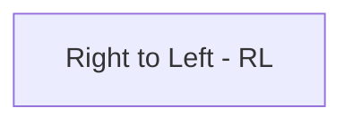

### Direction Examples

#### Top-Down (TB or TD) - Default
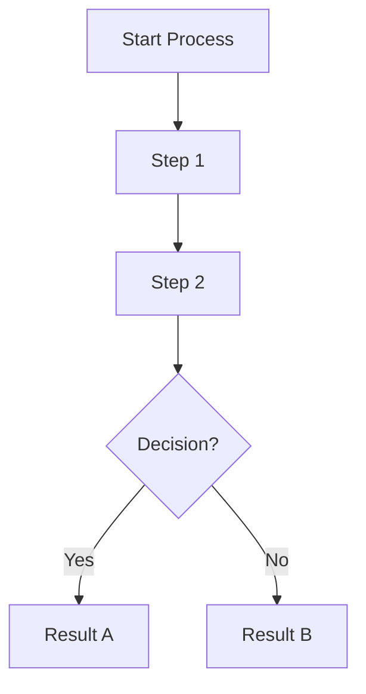

#### Left-Right (LR) - Horizontal Flow
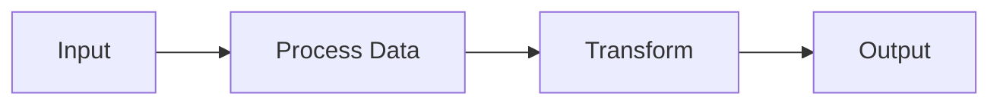

## Node Positioning Strategies

### 1. Invisible Nodes for Spacing

Use invisible nodes to create space and control layout:

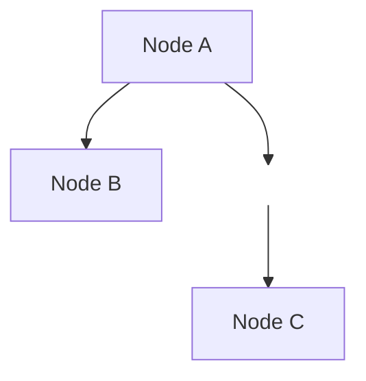

### 2. Link Lengths for Distance Control

Use different arrow styles to imply distance:

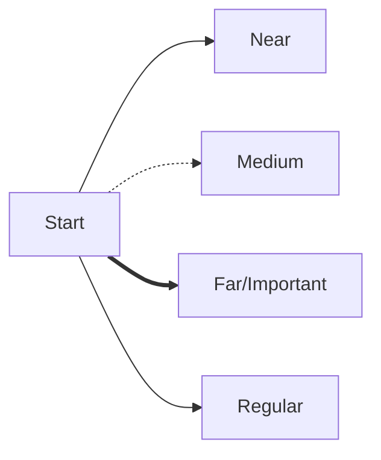

### 3. Explicit Ordering with Sequential Connections

Force nodes to appear in specific order:

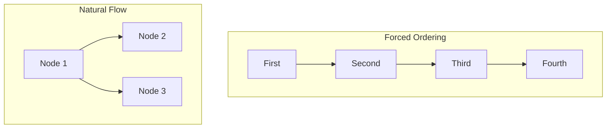

## Subgraphs for Layering

Subgraphs are the primary way to create visual layers and groupings:

### Basic Subgraph Layers

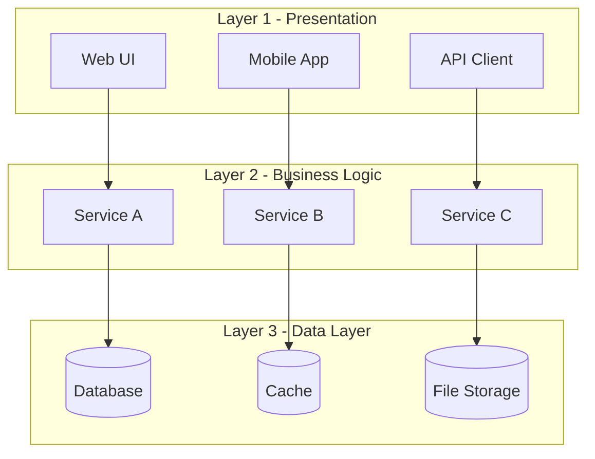

### Nested Subgraphs for Hierarchy

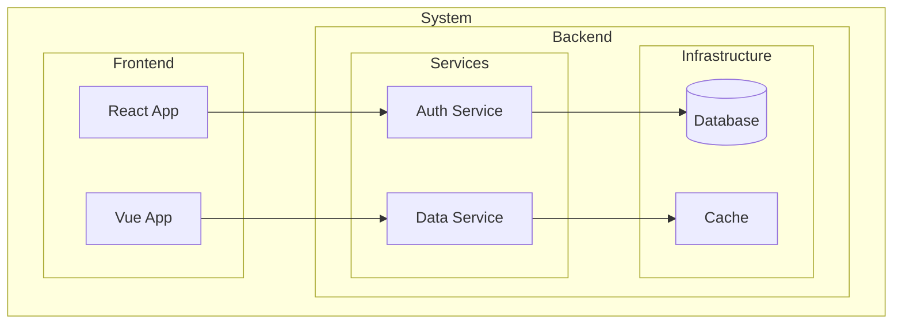

### Side-by-Side Subgraphs

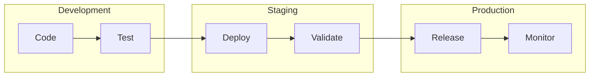

## Advanced Layout Techniques

### 1. Rank Alignment (Simulating GraphViz Ranks)

While Mermaid doesn't have explicit rank control like GraphViz, you can simulate it:

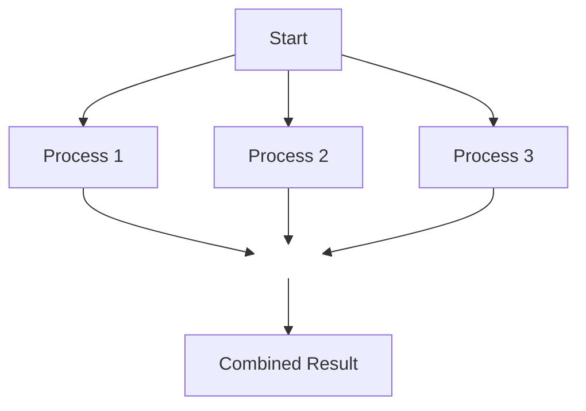

### 2. Diamond/Rhombus Layouts

Create diamond patterns for decision trees:

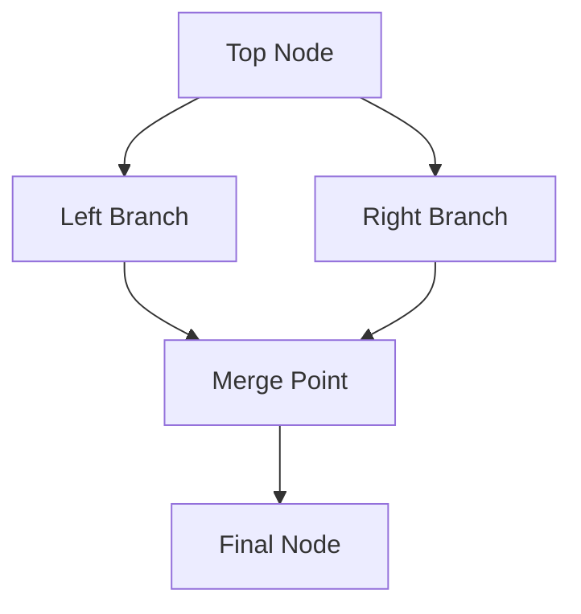

### 3. Matrix/Grid Layout

Simulate a grid using subgraphs and careful connections:

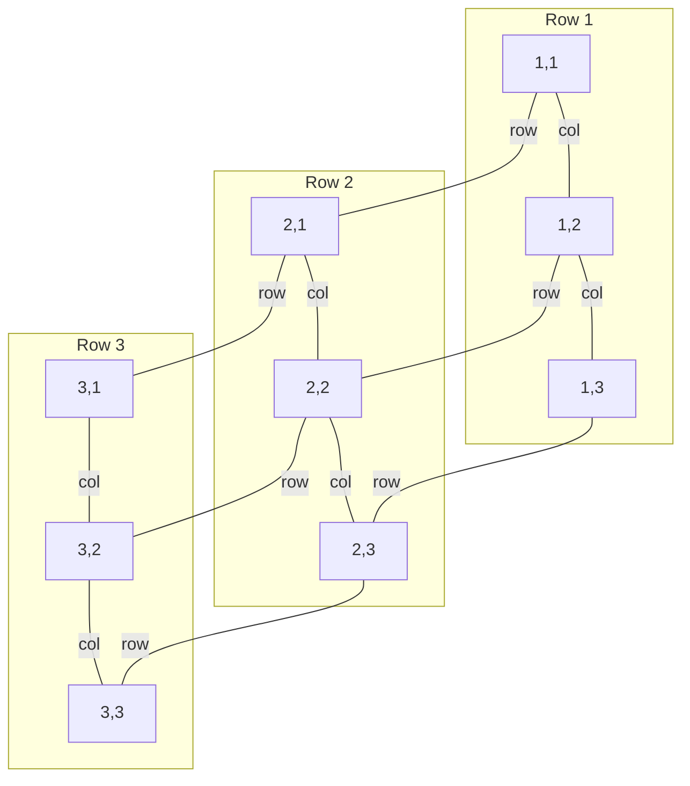

### 4. Circular/Radial Layout (Simulated)

While Mermaid doesn't support true circular layouts, you can approximate:

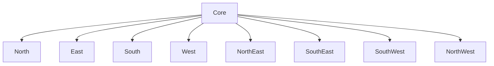

## Common Layout Patterns

### 1. Three-Tier Architecture

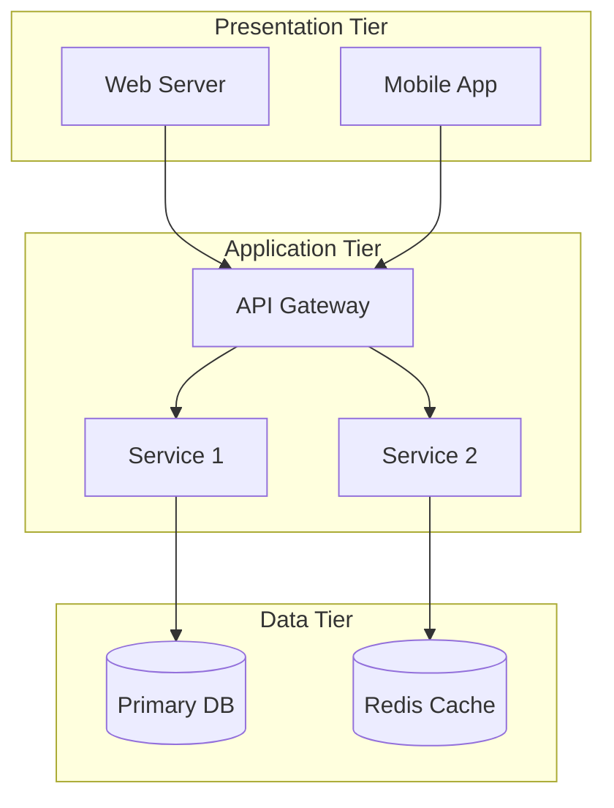

### 2. Pipeline/Workflow Pattern

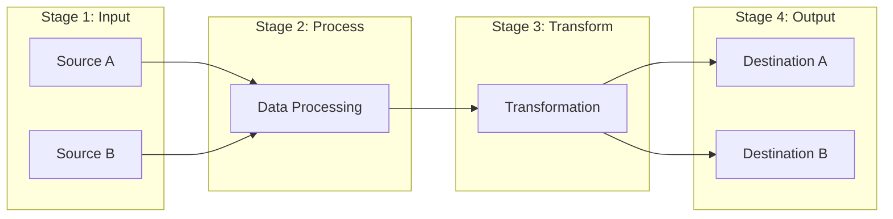

### 3. Hub and Spoke Pattern

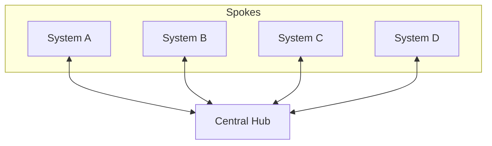

### 4. Hierarchical Tree

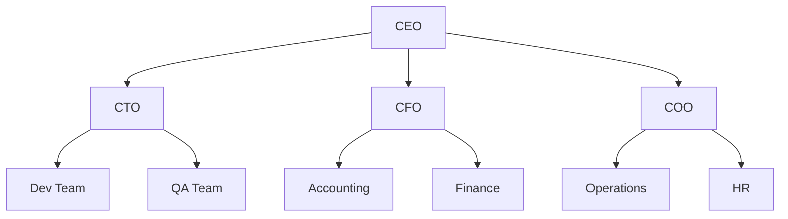

## Tips & Best Practices

### 1. Use Comments for Organization

```mermaid
graph TD
    %% Input Layer
    Input[User Input]
    
    %% Processing Layer
    Input --> Validate[Validation]
    Validate --> Process[Processing]
    
    %% Output Layer
    Process --> Format[Format Output]
    Format --> Display[Display Result]
```

### 2. Consistent Node Naming Convention

```mermaid
graph LR
    %% Use prefixes for different layers
    UI_Login[Login Page]
    UI_Dashboard[Dashboard]
    
    API_Auth[Auth API]
    API_Data[Data API]
    
    DB_Users[(Users DB)]
    DB_Sessions[(Sessions DB)]
    
    UI_Login --> API_Auth
    UI_Dashboard --> API_Data
    API_Auth --> DB_Users
    API_Auth --> DB_Sessions
```

### 3. Color Coding for Visual Hierarchy

```mermaid
graph TD
    A[Input]:::input
    B[Process]:::process
    C[Output]:::output
    
    A --> B --> C
    
    classDef input fill:#e1f5fe,stroke:#01579b,stroke-width:2px
    classDef process fill:#fff3e0,stroke:#e65100,stroke-width:2px
    classDef output fill:#e8f5e9,stroke:#1b5e20,stroke-width:2px
```

### 4. Link Styling for Importance

```mermaid
graph LR
    A[Start] ==>|Critical Path| B[Important]
    A -->|Normal Path| C[Regular]
    A -.->|Optional Path| D[Optional]
    
    style B fill:#ff9999,stroke:#ff0000,stroke-width:3px
```

### 5. Managing Complex Diagrams

For very complex diagrams:

1. **Break into multiple diagrams**: Instead of one huge diagram, create several focused ones
2. **Use subgraphs liberally**: Group related nodes
3. **Consider direction changes**: Mix TB and LR in different subgraphs
4. **Use consistent spacing**: Add invisible nodes for alignment
5. **Minimize crossing lines**: Reorder nodes to reduce line crossings

### Example: Complex System with Multiple Techniques

```mermaid
graph TB
    subgraph "User Layer"
        direction LR
        User1[Desktop Users]
        User2[Mobile Users]
        User3[API Clients]
    end
    
    subgraph "Gateway Layer"
        direction LR
        GW[API Gateway]
        LB[Load Balancer]
    end
    
    subgraph "Service Layer"
        direction LR
        Auth[Auth Service]
        Data[Data Service]
        Process[Process Service]
    end
    
    subgraph "Data Layer"
        direction LR
        Primary[(Primary DB)]
        Replica[(Replica DB)]
        Cache[(Cache)]
    end
    
    User1 --> GW
    User2 --> GW
    User3 --> GW
    
    GW --> LB
    
    LB --> Auth
    LB --> Data
    LB --> Process
    
    Auth --> Cache
    Data --> Primary
    Data --> Replica
    Process --> Primary
    
    Primary -.->|Replication| Replica
    
    classDef userNode fill:#e3f2fd,stroke:#1565c0
    classDef serviceNode fill:#fff3e0,stroke:#ef6c00
    classDef dataNode fill:#f3e5f5,stroke:#6a1b9a
    
    class User1,User2,User3 userNode
    class Auth,Data,Process serviceNode
    class Primary,Replica,Cache dataNode
```

## Limitations and Workarounds

### What Mermaid Can't Do (and Workarounds)

1. **True rank-based layouts** (like GraphViz's rank=same)
   - Workaround: Use subgraphs and invisible nodes

2. **Precise node positioning** (x,y coordinates)
   - Workaround: Use directional flow and subgraphs strategically

3. **Circular/radial layouts**
   - Workaround: Manually arrange nodes in approximate circle

4. **Orthogonal edge routing** (only straight lines at 90°)
   - Workaround: Use intermediate invisible nodes

5. **Node alignment across subgraphs**
   - Workaround: Connect to shared invisible nodes

## Comparison with GraphViz

| Feature | GraphViz | Mermaid | Mermaid Workaround |
|---------|----------|---------|-------------------|
| Rank control | `rank=same` | ❌ | Use subgraphs |
| Precise positioning | `pos="x,y"` | ❌ | Strategic connections |
| Multiple layout engines | dot, neato, fdp, etc. | ❌ | Use direction changes |
| Constraint control | `constraint=false` | ❌ | Use different arrow types |
| Cluster ranking | ✅ | Partial | Nested subgraphs |
| Edge routing | Multiple options | Limited | Invisible nodes |

## Best Practices Summary

1. **Start with the right direction** (TB, LR, BT, RL)
2. **Use subgraphs** to create visual layers and groupings
3. **Leverage invisible nodes** for spacing and alignment
4. **Apply consistent naming** conventions with prefixes
5. **Use color coding** to enhance visual hierarchy
6. **Break complex diagrams** into smaller, focused ones
7. **Comment your diagram** code for maintainability
8. **Test different layouts** to find the best visualization

Remember: While Mermaid may not have all of GraphViz's advanced layout features, its simplicity and integration with Markdown make it excellent for documentation and quick visualizations. The key is understanding its limitations and working creatively within them.