# Mermaid UML Class Diagram Guide

## Quick Reference for UML Relationships in Mermaid

### Basic Syntax
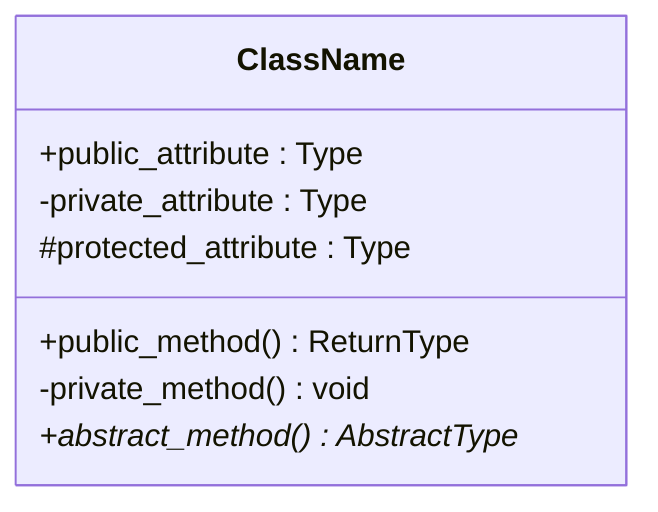

## UML Relationship Types & Mermaid Syntax

### 1. **Inheritance/Generalization** (IS-A)
**"Child extends/inherits from Parent"**
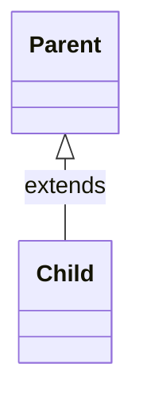
- **Arrow**: `<|--` (hollow triangle pointing to parent)
- **Meaning**: Child IS-A Parent
- **Python**: `class Child(Parent):`

### 2. **Interface Implementation/Realization**
**"Class implements Interface"**
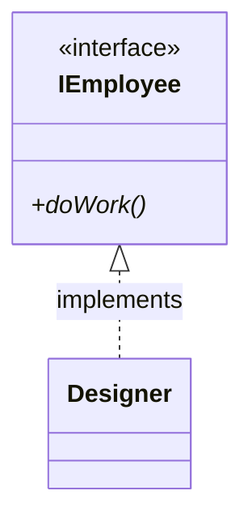
- **Arrow**: `<|..` (dashed line with hollow triangle)
- **Meaning**: Designer realizes/implements IEmployee interface
- **Python**: `class Designer(IEmployee):`  where IEmployee is an ABC

### 3. **Association** (HAS-A)
**"Class A has a permanent relationship with Class B"**
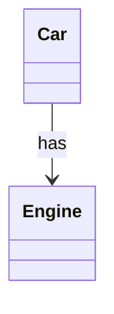
- **Arrow**: `-->` (solid line with arrow)
- **Meaning**: Car HAS an Engine (stored as attribute)
- **Python**: `self.engine = Engine()`

### 4. **Dependency** (USES-A)
**"Class A temporarily uses Class B"**
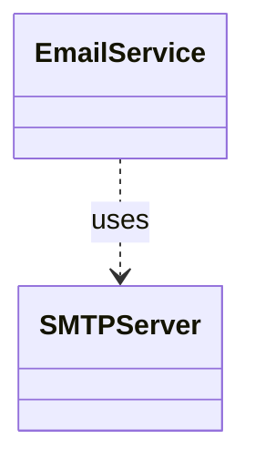
- **Arrow**: `..>` (dashed line with arrow)
- **Meaning**: EmailService USES SMTPServer (parameter/local variable)
- **Python**: `def send(self, smtp_server: SMTPServer):`

### 5. **Aggregation** (Weak HAS-A)
**"Class A has Class B, but B can exist independently"**
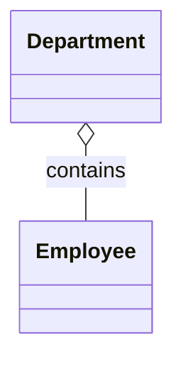
- **Arrow**: `o--` (hollow diamond at owner)
- **Meaning**: Department contains Employees (but Employees can exist without Department)
- **Python**: `self.employees = [emp1, emp2]`  # employees exist elsewhere too

### 6. **Composition** (Strong HAS-A)
**"Class A owns Class B, B cannot exist without A"**
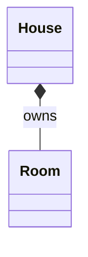
- **Arrow**: `*--` (filled diamond at owner)
- **Meaning**: House owns Rooms (Rooms don't exist without House)
- **Python**: `self.rooms = [Room(), Room()]`  # created by House

## Complete Arrow Reference Table

| Relationship | Mermaid Syntax | Line Style | Arrow Type | Meaning |
|-------------|---------------|------------|------------|---------|
| Inheritance | `<\|--` | Solid | Hollow triangle | IS-A (extends) |
| Implementation | `<\|..` | Dashed | Hollow triangle | Implements interface |
| Association | `-->` | Solid | Open arrow | HAS-A (permanent) |
| Dependency | `..>` | Dashed | Open arrow | USES-A (temporary) |
| Aggregation | `o--` | Solid | Hollow diamond | Weak ownership |
| Composition | `*--` | Solid | Filled diamond | Strong ownership |
| Bidirectional | `<-->` | Solid | Double arrow | Both know each other |
| Note link | `..` | Dashed | None | Links note to class |

## Class Modifiers

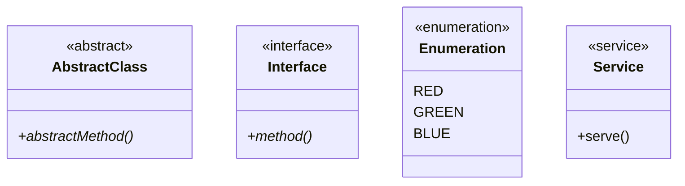

## Visibility Modifiers

- `+` Public
- `-` Private  
- `#` Protected
- `~` Package/Internal

## Practical Examples

### Example 1: Interface Implementation vs Dependency
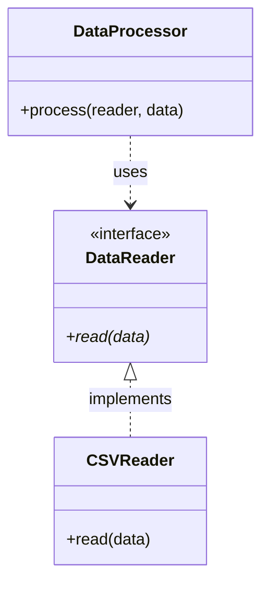

### Example 2: Association vs Composition vs Aggregation
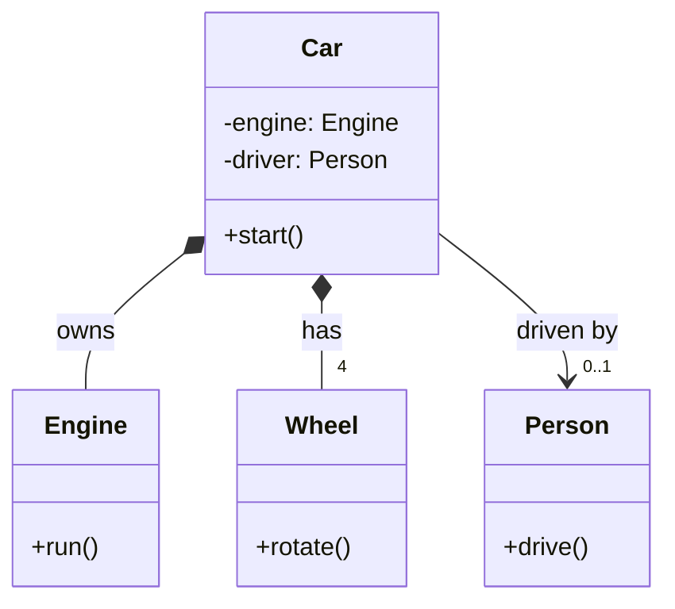

### Example 3: Complete System with All Relationships
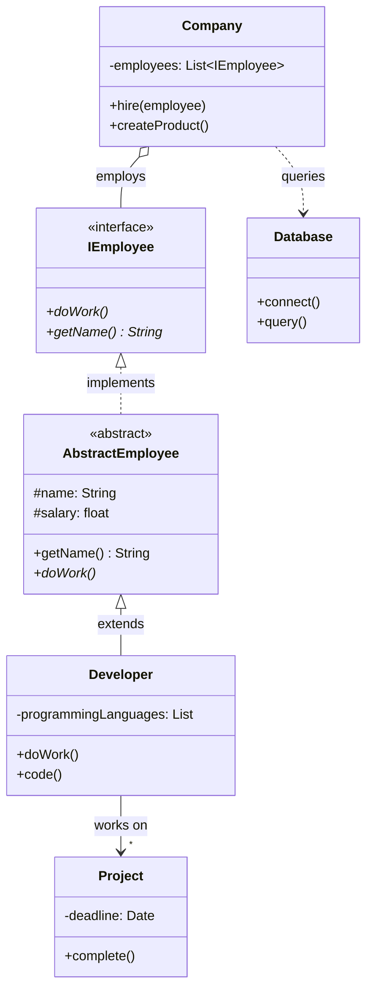

## Cardinality/Multiplicity

Add numbers to show how many instances:
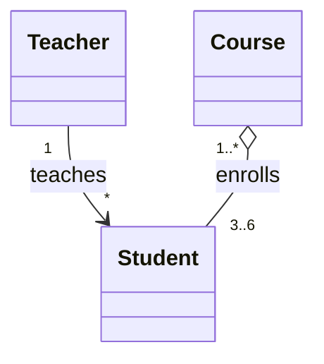

Common multiplicities:
- `1` - Exactly one
- `0..1` - Zero or one
- `*` or `0..*` - Zero or more
- `1..*` - One or more
- `n` - Exactly n
- `n..m` - Between n and m

## Adding Notes

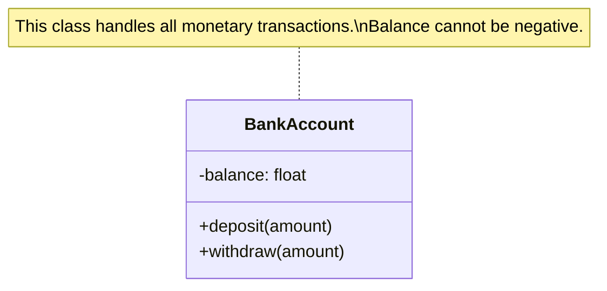

## Tips for Clear UML Diagrams

1. **Use the right arrow for the relationship**:
   - Implements interface? Use `<|..`
   - Extends class? Use `<|--`
   - Has as attribute? Use `-->`
   - Uses as parameter? Use `..>`

2. **Show important methods and attributes**:
   - Don't show every getter/setter
   - Focus on key behaviors
   - Show attributes that represent relationships

3. **Use stereotypes to clarify**:
   - `<<interface>>` for interfaces
   - `<<abstract>>` for abstract classes
   - `<<enumeration>>` for enums

4. **Add notes for complex logic**:
   - Explain invariants
   - Document design decisions
   - Clarify multiplicities

## Common Mistakes to Avoid

❌ **Wrong**: Using inheritance arrow for interface implementation
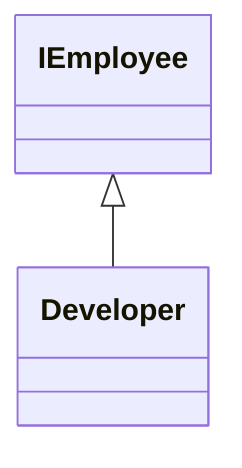

✅ **Correct**: Using realization arrow for interface implementation
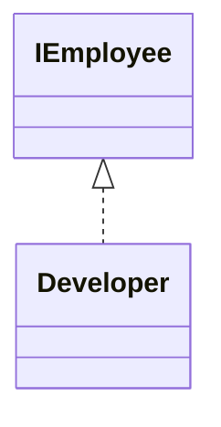

❌ **Wrong**: Using association for temporary usage

✅ **Correct**: Using dependency for temporary usage
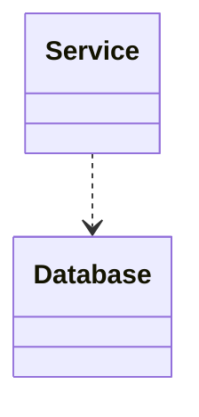

## Python to UML Mapping

| Python Code | UML Relationship | Mermaid |
|------------|-----------------|---------|
| `class Child(Parent):` | Inheritance | `Parent <\|-- Child` |
| `class Impl(ABC):` | Implementation | `ABC <\|.. Impl` |
| `self.attr = OtherClass()` | Association/Composition | `Class --> OtherClass` or `Class *-- OtherClass` |
| `def method(self, param: OtherClass):` | Dependency | `Class ..> OtherClass` |
| `self.items = external_items` | Aggregation | `Class o-- Item` |